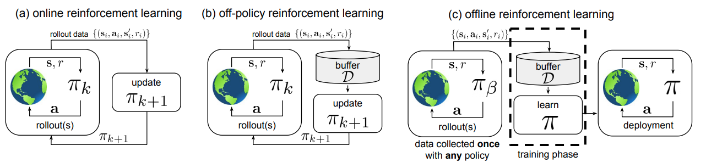

# Research Trend in RL

최근 열린 NeurIPS 2020(2020/12/06~2020/12/12)에서 소개된 기술을 토대로 최신 RL 연구의 방향성을 정리하였습니다

## Offline RL (Batch Reinforcement Learning)

- 왜 (why should we care)

기본적으로 RL이 데이터로부터 완전히 자유로워졌다고 생각하면 오산입니다. RL도 결국 학습을 위해서는 (s,a,s',r)로 이루어진 데이터로부터 
정책을 업데이트 해 나가기 때문입니다. 다만 지도학습과 다르게 학습에 필요한 데이터를 실물과의 상호작용을 통해 스스로 마련한다는 점이 다른 것뿐입니다.  

이것이 RL의 장점이자 곧 단점으로 이어지는데요, 장점은 얘기했듯이 사람이 데이터를 확보하는데 따로 추가적인 노력이나 전처리 등이 필요하지 않다는 것입니다.  

반면에 단점은, RL이 학습을 진행하기 위해서는 오로지 실물(혹은 시뮬레이터)와의 상호작용을 통해서만 그 데이터를 얻을 수 있기 때문에, 학습에 시간이 
상당히 많이 소요되고(대부분 rollout(실) 시간) 기기에 따라 어마어마한 cost를 필요로 하기도 합니다. 또한 초기에 제대로 학습되지 않은 상태에서의 동작은 
안전성 문제를 일으킬 수 있으며 이렇게 online으로 순차 업데이트되는 정책에서 얻은 데이터는 `distribution shift`를 야기하여 generalization 성능
저하를 일으키는 문제가 발생니다.
>

- 무엇을 (what are the issues)
  현재 여기서 논의 되는 `Offline RL`은 `Off-policy`와는 다릅니다 (위 그림에서 b, c의 차이)  
  본래는 `On-policy` 와 `Off-policy`의 두 가지로 나누어 구분하였지만, 추가적인 상호작용을 통한 데이터 확보 여부를 기준으로 `Offline RL`이라는 
  텀이 생겨났습니다.  
  

  즉 여기서는 

- 어떻게 (how to solve)

## Exploration & Exploitation (Efficient Learning)

## Safe RL (Constrained RL)

## Generalization & Adaptation

## Representation Learning (POMDP)

## Reward Design